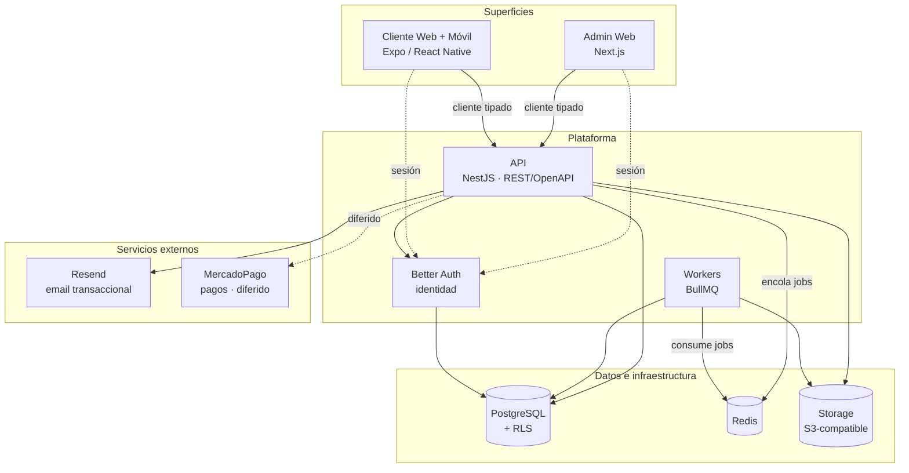

# Overview de arquitectura

## Qué es

Plataforma SaaS multi-tenant para administradoras de consorcios. Una administradora (el cliente que
paga) gestiona N consorcios; cada consorcio tiene sus unidades funcionales, propietarios e inquilinos.
El producto cubre lo típico de una administradora (liquidación de expensas, cobranzas, gastos,
proveedores, comunicación) más un módulo de analítica e IA y un motor de alertas.

## Jerarquía de tenancy

Tres niveles: **plataforma → administradora (tenant) → consorcio**. El aislamiento entre administradoras
se enforcea con Row-Level Security de PostgreSQL (ver [ADR-0005](../adr/0005-multitenancy-rls.md)).

## Superficies

- **Admin web** (Next.js) — usado por la administradora y su equipo. Denso en datos, desktop-first.
- **Cliente web + móvil** (un único codebase Expo/React Native) — usado por propietarios e inquilinos.
  Behind login, sin necesidad de SEO/SSR (ver [ADR-0006](../adr/0006-frontends-next-expo.md)).

Ambas superficies consumen la misma API mediante clientes tipados generados desde el spec OpenAPI.

## Diagrama de contenedores

## Rol de cada contenedor

- **API (NestJS)** — núcleo de negocio. Monolito modular. Expone REST documentado con OpenAPI; setea
  la variable de sesión de RLS por request a partir de la membresía del usuario.
- **Better Auth** — autenticación (identidad, sesiones, password, MFA, social). Dueño de sus propias
  tablas. La autorización (rol + scope de consorcio) vive en tablas propias del dominio
  (ver [ADR-0007](../adr/0007-auth-better-auth.md)).
- **Workers (BullMQ)** — trabajo en background: liquidaciones en lote, OCR de facturas/reglamentos,
  envío de mails/push, y crons de vencimientos legales y alertas zonales.
- **PostgreSQL** — única base de datos, schema único, aislamiento por RLS. Dinero en `numeric`.
- **Redis** — backend de colas (BullMQ) y cache.
- **Storage S3-compatible** — comprobantes, PDFs de liquidación, reglamentos escaneados
  (MinIO en dev).
- **Resend** — email transaccional (verificación y reset de Better Auth; templates de liquidación
  más adelante).
- **MercadoPago** — pagos. Diferido; llega con cobranzas (ver [deferred-decisions](../adr/deferred-decisions.md)).

## Módulo de IA

Dos capas estrictamente separadas: una capa de analítica **determinística** (código) que computa los
hechos y produce *drivers* estructurados, y el LLM que **solo redacta prosa** a partir de esos drivers.
El LLM nunca calcula. Ver [ADR-0008](../adr/0008-modulo-ia.md).
